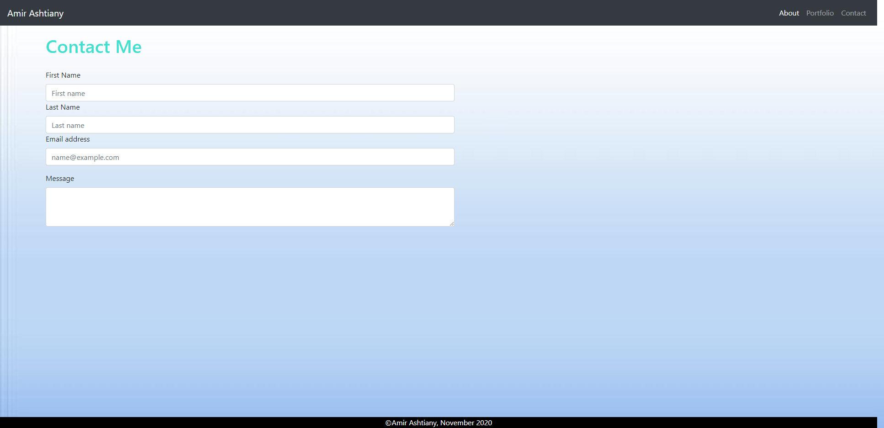
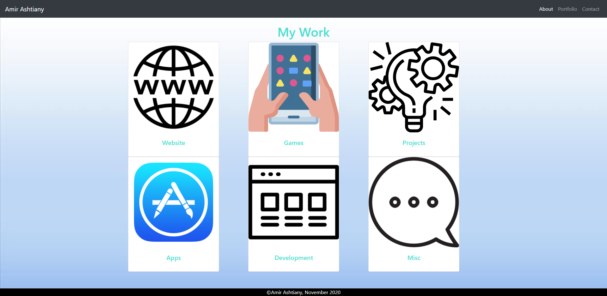

# Responsive Portfolio

### - Responsive Portfolio that includes a contact,about me and portfolio page.

### - Includes a responsive Navbar, a responsive layout and responsive images.

### - Also includes links for my github,facebook,instagram and linkedin.

### - Uses bootstrap and bootstrap grid system.

## Screenshots:

Thank you to Johnnie Simpson for help with positioning and clearing up some confusion I had!
- Johnnie's Github: https://github.com/balokdecoy

Websites Used:
- For fonts: https://fontawesome.com/
- Boostrap: https://getbootstrap.com/
